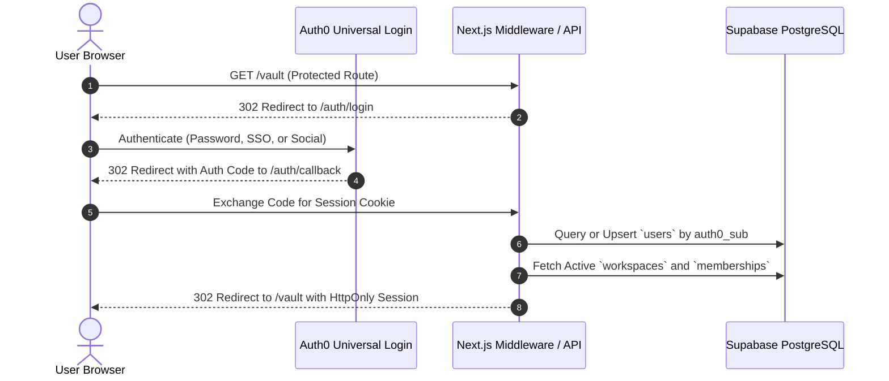
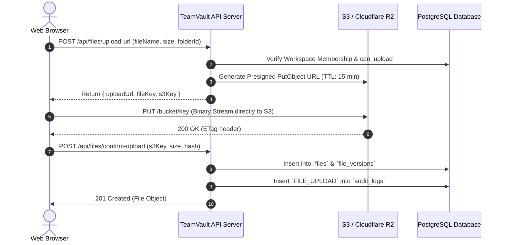
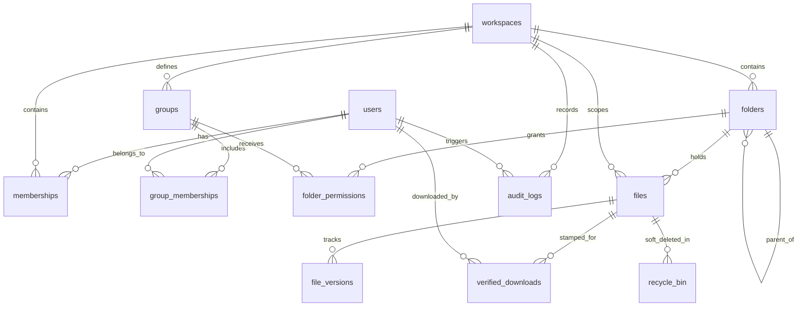

# TeamVault Architecture Documentation

This document describes the high-level architecture, subsystem design, data flow, and structural topology of **TeamVault Community Edition**.

---

## 1. System Overview

TeamVault is a self-hosted, source-available team file vault and secure document collaboration system built on Next.js 16 (React 19), Supabase (PostgreSQL), and agnostic S3-compatible object storage. It is complemented by native desktop synchronization clients written in Go.

### High-Level Architectural Diagram

```mermaid
graph TD
    subgraph Clients["Client Layer"]
        Browser["Modern Web Browser<br/>(React 19 / Tailwind CSS)"]
        DriveGUI["TeamVault Drive GUI<br/>(Go 1.21+ / Wails v2 / React)"]
        CLIClient["TeamVault CLI Sync<br/>(Headless Go Daemon)"]
    end

    subgraph Edge["Gateway & Edge"]
        ReverseProxy["Reverse Proxy / CDN<br/>(Nginx / Caddy / Cloudflare)"]
    end

    subgraph AppTier["Application Tier (Next.js 16 App Router)"]
        ServerRoutes["Next.js Server Actions & API Routes<br/>(Node.js 20.9+ / 22 LTS)"]
        AuthResolver["Auth0 Session & User Hydration<br/>(@auth0/nextjs-auth0)"]
        WatermarkEngine["Forensic Watermark Engine<br/>(pdf-lib)"]
        DiagnosticsEngine["Diagnostic Console Engine<br/>(/install-check)"]
    end

    subgraph Identity["Identity & Authentication"]
        Auth0["Auth0 Universal Login<br/>(OIDC / OAuth 2.0 / JWT)"]
    end

    subgraph Persistence["Persistence & Storage Tier"]
        DB[(PostgreSQL / Supabase)<br/>13 Normalized Relational Tables]
        S3Storage[(S3-Compatible Object Storage)<br/>Cloudflare R2 / AWS S3 / Wasabi / MinIO]
    end

    Browser -->|HTTPS / WSS| ReverseProxy
    DriveGUI -->|HTTPS REST / Delta Sync| ReverseProxy
    CLIClient -->|HTTPS REST / Delta Sync| ReverseProxy

    ReverseProxy --> ServerRoutes
    ServerRoutes --> Auth0
    ServerRoutes --> DB
    ServerRoutes --> S3Storage

    Browser -.->|Direct Presigned PUT/GET| S3Storage
    ServerRoutes --> WatermarkEngine
    ServerRoutes --> DiagnosticsEngine
```

---

## 2. Component Topology & Codebase Layout

The project repository is structured cleanly into web application, desktop client, database scripts, and utility modules:

```
teamvault-community/
├── src/
│   ├── app/                      # Next.js 16 App Router
│   │   ├── (auth)/               # Auth0 authentication routes (/auth/*)
│   │   ├── (dashboard)/          # Authenticated workspace UI & File Vault
│   │   ├── admin/                # Workspace administration & member management
│   │   ├── master-admin/         # Global platform administrator console
│   │   ├── install-check/        # Zero-login diagnostic & health check suite
│   │   └── api/                  # Backend REST API endpoints
│   │       ├── files/            # Upload authorization, metadata, folder ops
│   │       ├── download/         # Direct presigned & watermarked downloads
│   │       ├── sync/             # Desktop client delta synchronization API
│   │       └── audit/            # Tamper-evident audit logging ingestion & query
│   ├── components/               # React 19 UI components
│   │   ├── vault/                # File grid, table view, folder navigation
│   │   ├── preview/              # FenceView, PDF viewer, office file viewers
│   │   ├── admin/                # User invites, role toggles, audit views
│   │   └── ui/                   # Reusable design system primitives
│   ├── lib/                      # Core business logic & backend services
│   │   ├── s3-storage.ts         # Agnostic S3 client factory & presigners
│   │   ├── supabase.ts           # Dual-key Supabase database client
│   │   ├── auth.ts               # Auth0 user session hydration & RBAC helpers
│   │   ├── watermark.ts          # Forensic PDF watermarking & verification tokens
│   │   └── audit.ts              # Immutable audit logging engine
│   └── db/                       # Database schema and migrations
│       ├── schema.community.sql  # Canonical Community Edition schema (13 tables)
│       └── migrations/           # Incremental schema evolution scripts
├── teamvault-drive/              # Native Desktop GUI client (Go + Wails v2)
│   ├── frontend/                 # Desktop UI (React, Vite, TypeScript)
│   ├── internal/                 # Go backend sync engine & local SQLite state
│   └── main.go                   # Wails entrypoint & native desktop binding
├── desktop-client/               # Headless command-line sync daemon (Go)
├── docs/                         # Architecture, Security, and Deployment manuals
└── scripts/                      # Operational scripts (CORS setup, diagnostics)
```

---

## 3. Core Subsystems

### 3.1 Authentication & Workspace Multi-Tenancy

TeamVault delegates user identity to **Auth0 Universal Login** while managing access control, workspaces, and permissions internally:

1. **Session Hydration**: On every authenticated request, `@auth0/nextjs-auth0` verifies the encrypted HttpOnly session cookie.
2. **User Record Resolution**: The internal database links the Auth0 `sub` claim (e.g. `auth0|12345` or `google-oauth2|67890`) to an internal `users` row. If a new user logs in, a profile is auto-provisioned.
3. **Workspace Multi-Tenancy**: Every resource (folders, files, versions, audit records) is scoped strictly by a `workspace_id` foreign key. Users can belong to multiple workspaces with distinct roles (`admin` or `user`) and granular permissions (`can_upload: boolean`).



---

### 3.2 Object Storage Abstraction & Presigned Transfers

To ensure high transfer speeds, minimal server CPU/RAM usage, and vendor independence, TeamVault uses an agnostic S3 layer implemented in [src/lib/s3-storage.ts](file:///c:/Users/kpitc/OneDrive/Documents/teamvault-community/source/src/lib/s3-storage.ts):

- **Agnostic S3 Provider Engine**: Supports Cloudflare R2, AWS S3, Wasabi, MinIO, Backblaze B2, Google Cloud Storage (via S3 interoperability), Ceph, and IBM Cloud Object Storage.
- **Direct-to-S3 Uploads**:
  1. The browser requests a presigned upload URL from `/api/files/upload-url`.
  2. The server verifies workspace membership and `can_upload` permissions, generates an S3 `PutObjectCommand` presigned URL with a 15-minute TTL, and returns it.
  3. The browser streams the file payload directly to S3/R2.
  4. Upon upload completion, the browser notifies `/api/files/confirm-upload` to commit the file metadata and record version history in PostgreSQL.



---

### 3.3 Forensic Watermarking & Verified Downloads

When watermarked downloads are enabled for confidential documents:
1. **Request Interception**: Rather than issuing a direct presigned GET URL, the download request is routed through the server endpoint `/api/download/watermark`.
2. **Dynamic Stamping**: The server streams the original PDF from S3 into memory, processes it via `pdf-lib`, and applies dynamic forensic watermarks:
   - Recipient email address
   - Timestamp of access
   - Client IP address and session token
   - Unique cryptographic verification code
3. **Audit Log & Verification Token**: A permanent record is inserted into the `verified_downloads` table.
4. **Leak Tracing**: The public or admin verification tool `/verify` can accept any leaked verification token or document snippet to identify the exact user and timestamp responsible for the leak.

---

### 3.4 Desktop Synchronization Architecture

TeamVault includes two native desktop sync clients:
- **`teamvault-drive/`**: GUI client built with **Go** and **Wails v2** with a React frontend.
- **`desktop-client/`**: Headless CLI daemon designed for automated server backups and headless workstations.

#### Delta Synchronization Pipeline
Both clients employ a local SQLite engine to maintain state:
1. **Local File Watching**: The client monitors configured local sync directories using native filesystem event watchers (`fsnotify`).
2. **Content-Addressed Hashing**: Files are partitioned into blocks and SHA-256 hashed. Unchanged files bypass network transfer completely.
3. **Server State Polling & Delta Calculation**: The client calls `/api/sync/delta` with its current high-water mark timestamp. The server returns changed, created, or deleted files.
4. **Bidirectional Conflict Resolution**: If local and remote files have been modified concurrently, the server creates a conflict version (e.g. `report (Conflicted Copy 2026-10-10).pdf`) preserving both copies without data loss.

---

## 4. Database Schema & Relational Model

The database layer is managed through [src/db/schema.community.sql](file:///c:/Users/kpitc/OneDrive/Documents/teamvault-community/source/src/db/schema.community.sql), consisting of 13 normalized tables:



### Table Breakdown

| Table | Purpose |
|---|---|
| `users` | Global user profiles linked to Auth0 identities (`auth0_sub`, email, name, avatar). |
| `workspaces` | Multi-tenant organization containers with storage limits, plan definitions, and custom settings. |
| `memberships` | User association with workspaces, defining organizational role (`admin`, `user`) and `can_upload`. |
| `groups` | Permission groupings (e.g. "Finance", "Engineering", "Contractors") within a workspace. |
| `group_memberships` | Many-to-many relationship mapping users to permission groups. |
| `folders` | Hierarchical directory tree supporting nested subfolders and breadcrumbs. |
| `folder_permissions` | Granular Access Control Lists (ACLs) associating groups with folders (`read`, `write`, `admin`). |
| `files` | Master file records with workspace scope, folder reference, size, MIME type, and active version pointer. |
| `file_versions` | Immutable file history records storing previous S3 keys, sizes, hashes, and upload metadata. |
| `recycle_bin` | Soft-deleted file safety pool with automated retention expiry calculation. |
| `audit_logs` | Append-only event log capturing authentication, file access, permission changes, and admin operations. |
| `verified_downloads` | Forensic log linking unique watermarking verification IDs to downloads, users, and IP addresses. |
| `drive_sync_state` | High-water mark state tracking per client device for rapid desktop synchronization. |

---

## 5. Dual-Key Supabase Integration

TeamVault supports Supabase's modern 2026 dual-key API standard alongside legacy JWT service role keys:

- **Browser/Public Key**: `NEXT_PUBLIC_SUPABASE_PUBLISHABLE_KEY` (`sb_publishable_...`) or legacy `NEXT_PUBLIC_SUPABASE_ANON_KEY`.
- **Server Master Key**: `SUPABASE_SECRET_KEY` (`sb_secret_...`) or legacy `SUPABASE_SERVICE_ROLE_KEY`.

The backend client automatically selects the modern secret key if present, falling back gracefully to the service role key. Database operations from server endpoints bypass Row Level Security (RLS) safely through server-side verification helpers.

---

## 6. Commercial Extension Mount Architecture

TeamVault is designed with a clear, clean boundary between the open **Community Edition** and the proprietary **Commercial Extension Overlay** (`teamvault-commercial`):

```
teamvault-commercial/ (Private Repo)
├── extensions/               # Additive modules (Stripe billing, AI agents, Geo-fencing)
│   ├── app/                  # Commercial routes mounted into /src/app/
│   ├── lib/                  # Billing & agent provisioning logic
│   └── db/                   # schema.commercial.sql migrations
└── community/                # Git Submodule pointing to teamvault-community
```

- **Zero Duplication**: The core application logic lives entirely in `teamvault-community`.
- **Mount Scripts**: In commercial deployments, `scripts/mount-extensions.mjs` maps commercial routes into Next.js at build time without modifying community source files.
