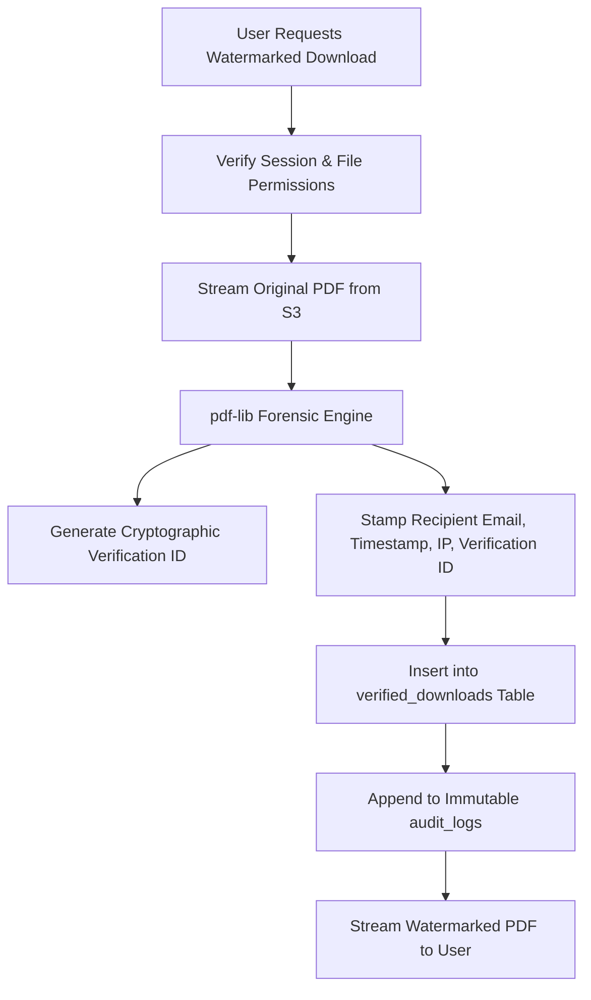

# TeamVault Security Policy & Architecture

This document outlines the security architecture, data protection controls, credential isolation practices, and responsible vulnerability disclosure process for **TeamVault Community Edition**.

---

## 1. Security Philosophy & Principles

TeamVault is designed with defense-in-depth principles for self-hosted and private enterprise environments:

1. **Zero-Trust Multi-Tenancy**: Tenant isolation is strictly enforced at both the relational database layer and the object storage hierarchy.
2. **Least Privilege**: Users possess only the permissions required for their specific role and assigned folder groups.
3. **Short-Lived Ephemeral Transfers**: Cloud storage buckets remain strictly private. File uploads and downloads leverage short-lived (15-minute max) cryptographically signed URLs.
4. **Credential Isolation**: Master secrets, database admin keys, and S3 credentials exist strictly in backend server environments and are never shipped in client bundles.
5. **Tamper-Evident Forensics**: Critical administrative, authentication, and file events produce immutable audit records. Confidential file downloads can be forensically stamped with dynamic, traceable watermarks.

---

## 2. Authentication & Session Management

TeamVault offloads primary identity authentication to **Auth0**, an enterprise-grade Identity as a Service (IDaaS) provider supporting OpenID Connect (OIDC) and OAuth 2.0.

### Session Architecture
- **Cookie Security**: Sessions are managed using `@auth0/nextjs-auth0`. Session cookies are encrypted with `AUTH0_SECRET` (minimum 32-byte rolling secret) and configured with:
  - `HttpOnly`: Prevents client-side JavaScript access, mitigating XSS token extraction.
  - `Secure`: Required in production, ensuring cookies are transmitted strictly over TLS/HTTPS.
  - `SameSite=Lax`: Defends against Cross-Site Request Forgery (CSRF).
- **Session Re-validation**: Active memberships and workspace roles are validated against the PostgreSQL database on each request, ensuring that revoked users immediately lose access without waiting for session expiry.
- **Deep-Link Redirection Protection**: Post-login redirect URLs (`returnTo`) are validated to prevent open-redirect vulnerabilities.

---

## 3. Multi-Tenancy & Access Control

### Workspace Isolation
TeamVault enforces strict workspace boundaries:
- Every folder, file, version, group, and audit event belongs to a `workspace_id`.
- Database queries across all API routes require an authenticated user with an active row in the `memberships` table matching the targeted `workspace_id`.
- S3 object keys are namespaced by workspace UUID: `workspaces/{workspace_id}/files/{file_id}/{version_id}`.

### Role-Based Access Control (RBAC) & Folder ACLs
- **Workspace Roles**:
  - `admin`: Full administrative control over the workspace, user invitations, permission group assignments, storage quota settings, and audit logs.
  - `user`: Standard member access governed by permission groups and individual upload permissions.
- **Granular Capabilities**:
  - `can_upload`: Per-user boolean flag allowing or prohibiting file upload operations, independent of folder read access.
- **Folder ACLs**: Folders inherit or explicitly define group access levels:
  - `read`: Can view folder contents and download files.
  - `write`: Can create subfolders, upload files, and upload new versions.
  - `admin`: Can modify folder permissions, rename, and delete folders.
- **Master Admin Protection**:
  - System-wide administration routes (`/master-admin`) are restricted to email addresses specified in the `MASTER_ADMIN_EMAILS` environment variable.
  - Email checks are verified against authenticated Auth0 session claims using case-insensitive canonical matching.

---

## 4. Object Storage & Data Protection

### Storage Bucket Isolation
- **Private Buckets**: S3 and Cloudflare R2 buckets are configured with **no public access**. Public read/list permissions are completely disabled.
- **Presigned URLs**:
  - File uploads use S3 `PutObjectCommand` presigned URLs valid for 15 minutes.
  - Standard file downloads use S3 `GetObjectCommand` presigned URLs valid for 15 minutes.
  - The browser interacts directly with object storage, meaning application servers do not act as bottlenecks or hold unnecessary file buffers for standard operations.
- **CORS Hardening**:
  - Object storage CORS rules should be restricted to the exact domain hosting TeamVault.
  - TeamVault provides an automated CORS configuration script:
    ```bash
    npx -y tsx scripts/set-storage-cors.ts
    ```

### Encryption at Rest and in Transit
- **In Transit**: All communication between clients, the Next.js application, Auth0, Supabase, and S3 endpoints requires TLS 1.2 or TLS 1.3.
- **At Rest**:
  - S3 / R2 buckets should be configured with Server-Side Encryption (SSE-S3 or SSE-KMS).
  - PostgreSQL database volumes (e.g. Supabase or self-hosted) should utilize disk-level AES-256 encryption.

---

## 5. Dual-Key Management & Secret Isolation

TeamVault adheres to Supabase's modern 2026 API key standard while supporting legacy credentials:

| Key Variable | Usage Context | Exposure |
|---|---|---|
| `NEXT_PUBLIC_SUPABASE_PUBLISHABLE_KEY` | Public client SDK initialization | Public (Browser) |
| `NEXT_PUBLIC_SUPABASE_ANON_KEY` *(Legacy)* | Public client SDK initialization | Public (Browser) |
| `SUPABASE_SECRET_KEY` | Master server database queries | **Secret (Server Only)** |
| `SUPABASE_SERVICE_ROLE_KEY` *(Legacy)* | Master server database queries | **Secret (Server Only)** |
| `STORAGE_SECRET_ACCESS_KEY` | S3 / R2 API operations | **Secret (Server Only)** |
| `AUTH0_CLIENT_SECRET` / `AUTH0_SECRET` | Auth0 token exchange & cookie encryption | **Secret (Server Only)** |

### Safeguards:
- Master secret keys are loaded exclusively in server runtime contexts (`Node.js`) and never referenced with `NEXT_PUBLIC_` prefixes.
- Build configurations and `.gitignore` prevent accidental check-ins of `.env`, `.env.local`, or certificate files.

---

## 6. Forensic Watermarking & Leak Prevention

For sensitive documents where data leakage or unauthorized sharing is a risk, TeamVault provides real-time forensic watermarking:



### Verification & Tamper Detection
- Each watermarked download embeds a unique verification token formatted visibly on document headers/footers and metadata.
- If a document is leaked (physically printed, screenshotted, or shared), administrators can input the document ID into `/verify` to view the original recipient's identity, IP address, and timestamp.

---

## 7. Hardening & Operational Security

### Diagnostic Console Security (`/install-check`)
The `/install-check` route is designed to verify configuration health during initial setup:
- **Redacted Output**: Secrets, API keys, and connection strings are masked (e.g., `sb_secret_••••••••••••`).
- **Production Hardening**: Once your installation has passed all verification checks, disable the diagnostic endpoint by adding the following to your environment:
  ```ini
  DISABLE_INSTALL_CHECK=true
  ```
  When set to `true`, the `/install-check` page returns a `404 Not Found`.

### Input Validation & SQL Injection Prevention
- All user input submitted to API routes is sanitized and validated using **Zod** schemas.
- Database access uses parameterized queries and typed Supabase client operations, preventing SQL injection vulnerabilities.

### Content Security Policy (CSP) & HTTP Headers
When deploying TeamVault in production behind a reverse proxy (Nginx, Caddy, Cloudflare), enforce the following security headers:

```nginx
# Recommended HTTP Security Headers
add_header X-Frame-Options "DENY" always;
add_header X-Content-Type-Options "nosniff" always;
add_header Referrer-Policy "strict-origin-when-cross-origin" always;
add_header Permissions-Policy "camera=(), microphone=(), geolocation=()" always;
add_header Strict-Transport-Security "max-age=63072000; includeSubDomains; preload" always;
```

---

## 8. Desktop Client Security

The native desktop synchronization clients (`teamvault-drive` and `desktop-client`):
- **Path Traversal Protection**: All remote file paths received from the server are sanitized to prevent directory traversal attacks (e.g., stripping `../` sequences and enforcing rooted target paths).
- **Symlink Boundary Checks**: The sync engine detects and refuses to follow symlinks that point outside of configured local synchronization directories.
- **Credential Storage**: Desktop clients authenticate using OAuth 2.0 PKCE / API tokens and store tokens in secure local operating system credential vaults where available.

---

## 9. Vulnerability Reporting & Disclosure Policy

We take the security of TeamVault seriously. If you discover a security vulnerability in TeamVault Community Edition, please follow responsible disclosure guidelines.

### Reporting Process
- **Email**: Send your findings to `security@teamvault.cloud` (or contact the maintainers via GitHub Security Advisories).
- **Information to Include**:
  - Description of the vulnerability and affected versions/endpoints.
  - Step-by-step reproduction instructions or a minimal Proof of Concept (PoC).
  - Potential impact assessment.
- **Response Timeline**:
  - **Initial Response**: Within 48 hours of report submission.
  - **Triage & Status Update**: Within 5 business days.
  - **Fix & Advisory Release**: Coordinated with the reporter before public disclosure.

Please do **not** open public GitHub issues for undisclosed security vulnerabilities.
